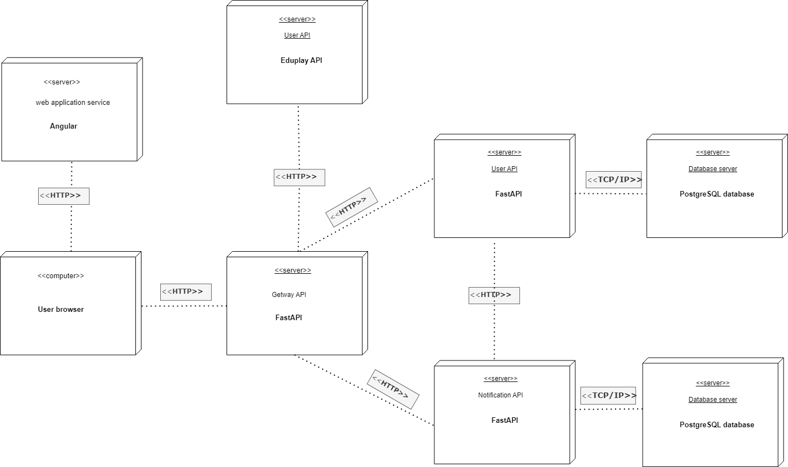

# Documento de Arquitetura

## 1. Introdução

Este documento detalha a estrutura do software de um projeto que incorpora Angular para o frontend. Ele é composto por quatro microsserviços desenvolvidos com FastAPI, um gateway em Node para facilitar a comunicação entre esses serviços e um banco de dados PostgreSQL, além de consumir a API do EduPlay para acessar os vídeos e programas ao vivo. A estrutura projetada tem foco na escalabilidade, resiliência e alto desempenho. Baseia-se no conceito de microsserviços, onde componentes distintos funcionam como serviços autônomos, interagindo por meio de interfaces claramente estabelecidas. Este é um esboço da arquitetura em um nível geral:

<figcaption style="text-align: center !important">
    Fonte: Próprio autor
  </figcaption>
</figure>

## 2. Tecnologias

### 2.1. Angular

Angular é empregado como a principal tecnologia de frontend neste projeto, proporcionando uma interface de usuário interativa e responsiva. Sua arquitetura robusta e recursos avançados de bidirectional data binding facilitam a gestão eficiente dos estados da interface, enquanto sua integração com os microsserviços via HTTP garante uma comunicação fluida e eficiente. Angular também contribui para uma manutenção mais fácil e um desenvolvimento ágil, graças à sua estrutura modular e ao extenso ecossistema de ferramentas.

### 2.2. FastAPI

FastAPI é utilizado neste projeto para desenvolver quatro microsserviços, destacando-se por sua alta performance e facilidade de uso. Este framework de Python permite a construção rápida de APIs eficientes, com recursos automáticos de documentação interativa e validação de dados. A escolha do FastAPI apoia a arquitetura de microsserviços do projeto, proporcionando uma comunicação ágil e confiável entre os diferentes serviços, além de facilitar a escalabilidade e manutenção do sistema.

### 2.3. PostgreSQL

No projeto, o PostgreSQL é utilizado como o sistema de gerenciamento de banco de dados, oferecendo uma solução robusta e confiável para armazenamento e recuperação de dados. Sua escolha deve-se à sua performance elevada, suporte a transações complexas e compatibilidade com os padrões SQL. Além disso, o PostgreSQL é conhecido por sua extensibilidade e forte conformidade com ACID, garantindo a integridade e a segurança dos dados. Essas características o tornam uma escolha adequada para gerenciar as informações críticas e assegurar a eficiência na manipulação de dados no contexto do projeto.

## 3. Representação dos serviços

-   Frontend: Responsável por todas as interações do usuário com o sistema, este serviço é o meio pelo qual o usuário pode acessar visualmente as funcionalidades oferecidas no contexto da aplicação. Exemplo: Logar por redes sociais ou email, visualizar o católogo dos vídeos com os programas, sugerir pauta, assistir ao canal ao vivo.

-   VideoService: Microserviço responsável pelos comentários nos vídeos e a grade de programação dos programas.

-   Users: Microsserviço responsável pela gestão dos usuários da aplicação.

-   Admin: Microsserviço responsável pela conta do admin, como delegar admin a outros usuários, receber as pautas sugeridas, gerar notificações para a aplicação.

-   API-Gateway : Responsável para realizar a interface do usuário com os demais serviços da aplicação, provendo autenticação e autorização.

## 4. Visão lógica

### 4.1. Diagrama de pacote Front-end

### 4.2. Diagrama de pacote Back-end

### 4.3. Diagrama de implantação

### 4.4. Diagrama de classe

#### 4.4.1. Microsserviço de usuário

## 2.1. Diagrama de Relações

O Diagrama de Relações é uma representação gráfica que ilustra como os componentes do sistema se comunicam e interagem. Nesse tipo de diagrama, você pode destacar as conexões e dependências entre os diferentes microserviços, o frontend e o backend do sistema. Isso ajuda a visualizar a arquitetura de software e entender como as partes se relacionam.

O estilo arquitetural apresentado acima, adota uma abordagem em que uma aplicação é dividida em unidades menores, chamadas de microsserviços, que funcionam de maneira autônoma com baixo acoplamento. Esses microsserviços podem interagir entre si geralmente por meio de APIs e são organizados com base em funções de negócios específicas.

## 5. Referências Bibliográficas

CREATELY. O Guia Fácil de Diagramas de Implantação UML. Disponível em: https://creately.com/blog/pt/diagrama/tutorial-do-diagrama-de-implantacao.

Geekhunter. O que são microsserviços e como funcionam?. Disponível em: https://blog.geekhunter.com.br/arquitetura-de-microsservicos-x-arquitetura-monolitica/.

## 6. Histórico de versão

| **Data**   | **Descrição**                                    | **Autore(es)**    |
| ---------- | ------------------------------------------------ | ----------------- |
| 22/10/2023 | Adição do documento                              | Sávio             |
| 22/10/2023 | Adiciona diagrama de classes e demais alterações | Gabrielle Ribeiro |
