## Gerencia de configuração
Para fazer o deploy utilizamos o heroku e netlify. A seguir será detalhado como foi feito para cada um dos repositórios.

## Deploy repositório ADMIN
# Crie um app:

# Conecte com github
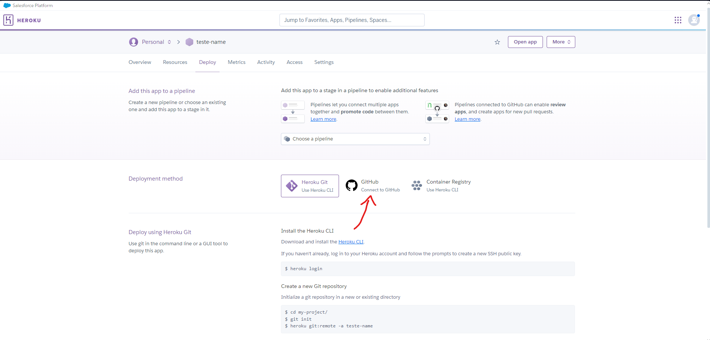
# Escolha o repositório

# Habilite o deploy automático

# Configure as variáveis de ambiente

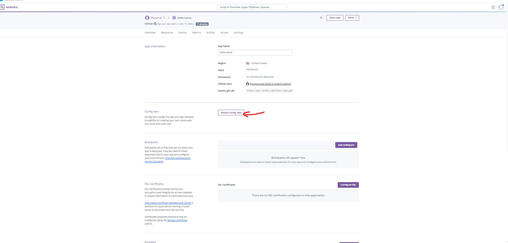
É necessário criar um email novo ou usar o existente, o aluno Lucas da Cunha Andrade entrou em contato com o Caio passando as credenciais do email utilizado durante a disciplina. Este email é usado para envio de sugestão de pauta, além de envio de código de confirmação de email do cadastro.
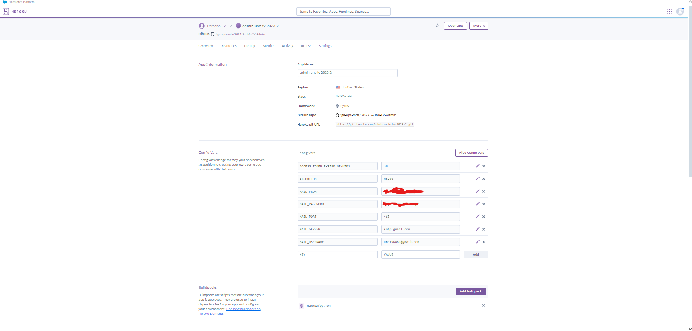

# Faça o deploy

## Deploy repositório USERS
# Crie um app:

# Conecte com github

# Escolha o repositório

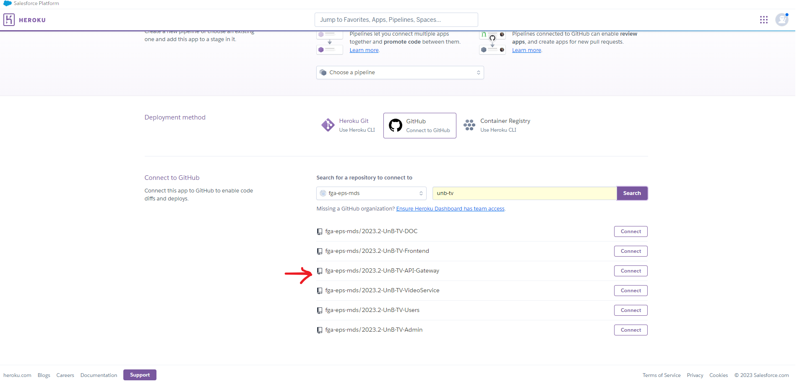
# Habilite o deploy automático

# Configure as variáveis de ambiente
Para este repositório é necessário adicionar addons do postgress e usá-las nas variáveis de ambiente

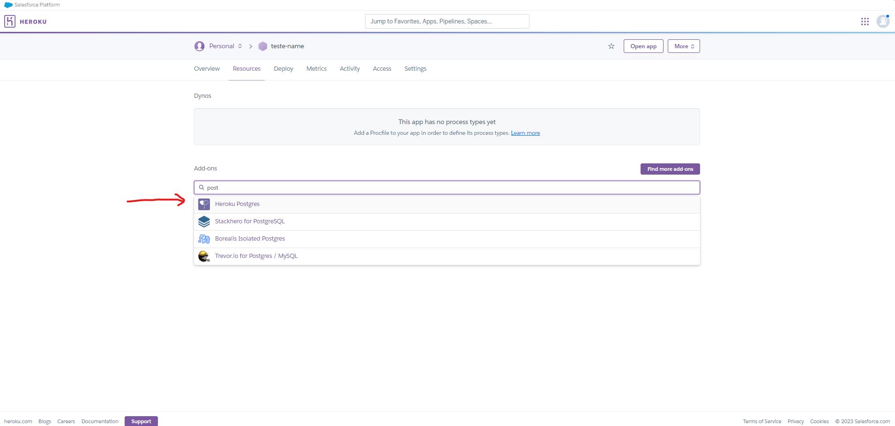
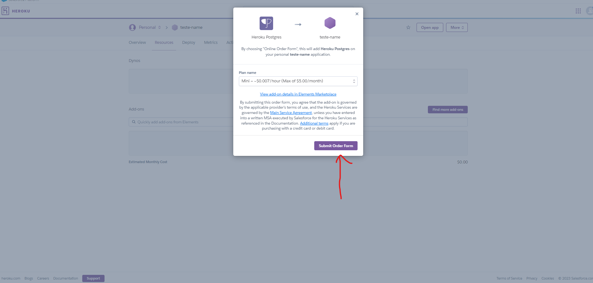

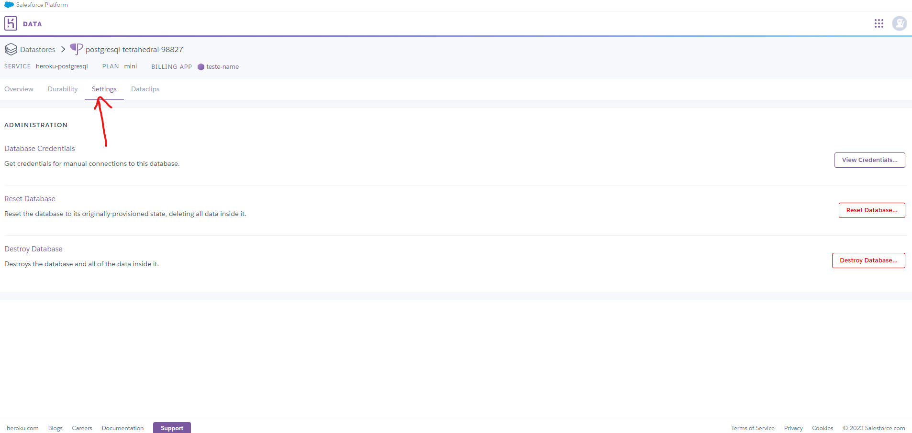

É necessário criar um email novo ou usar o existente, o aluno Lucas da Cunha Andrade entrou em contato com o Caio passando as credenciais do email utilizado durante a disciplina. Este email é usado para envio de sugestão de pauta, além de envio de código de confirmação de email do cadastro.

# Faça o deploy
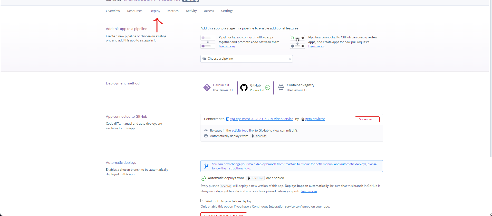
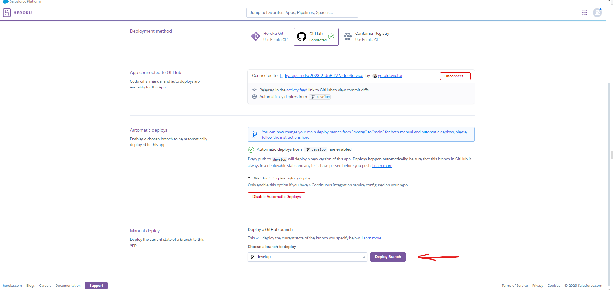

## Deploy repositório VIDEO
# Crie um app:

# Conecte com github

# Escolha o repositório

# Habilite o deploy automático
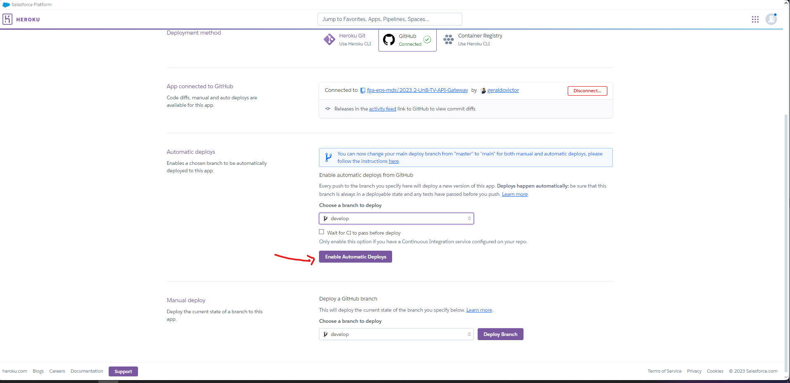
# Configure as variáveis de ambiente
Para este repositório é necessário adicionar addons do postgress e usá-las nas variáveis de ambiente

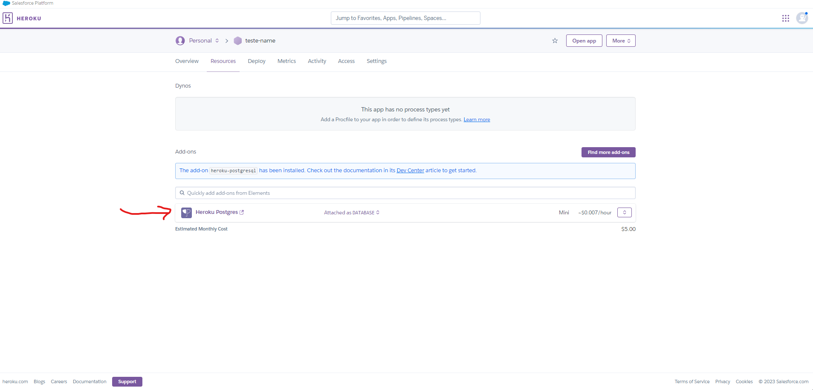

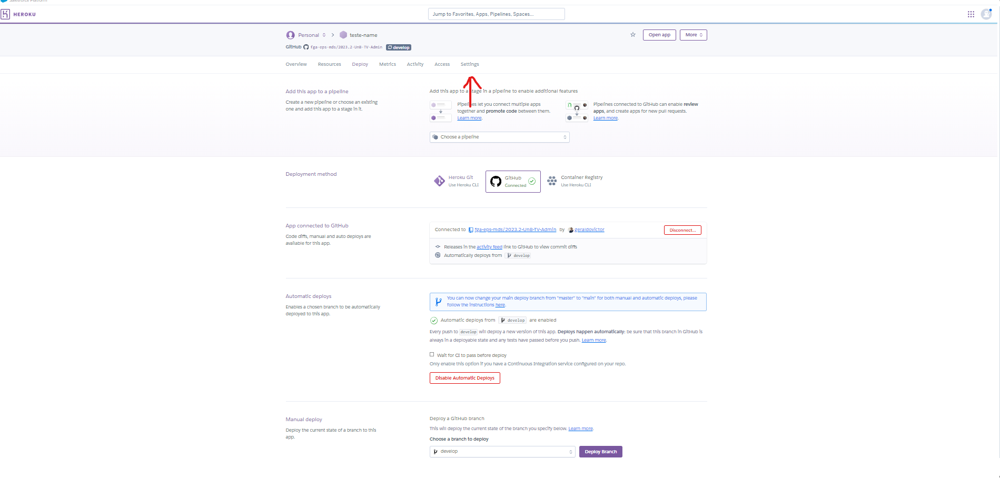

# Faça o deploy

## Deploy repositório GATEWAY
# Crie um app:

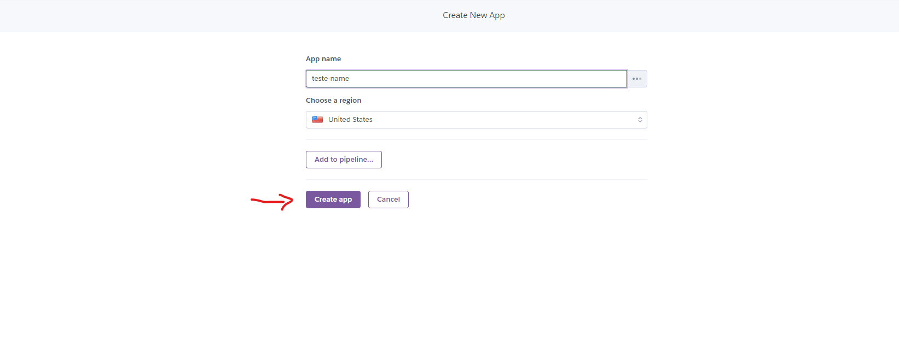
# Conecte com github

# Escolha o repositório
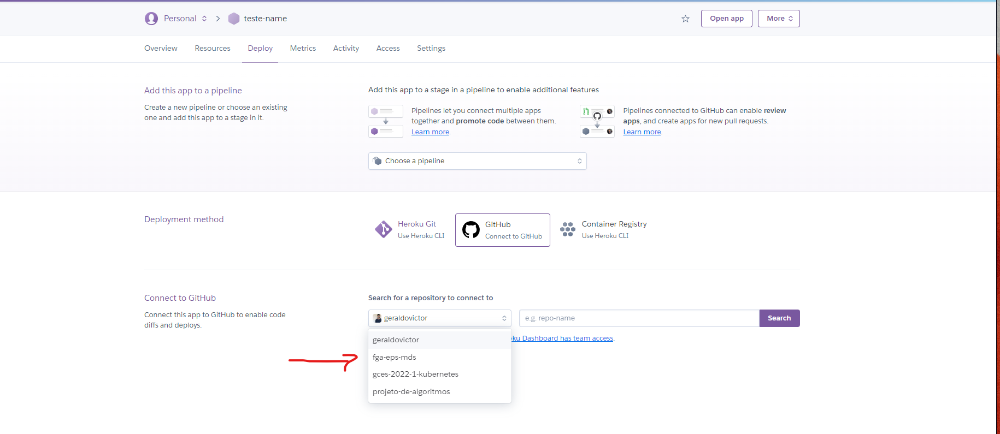
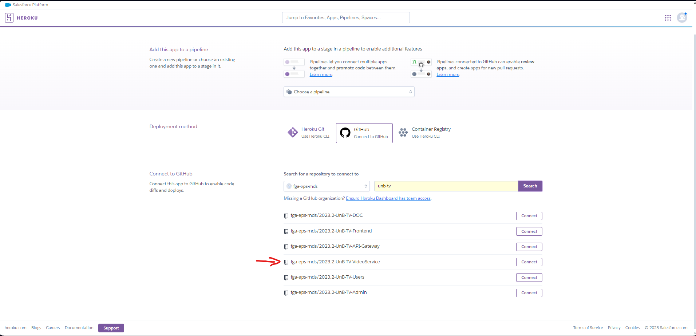
# Habilite o deploy automático

# Configure as variáveis de ambiente

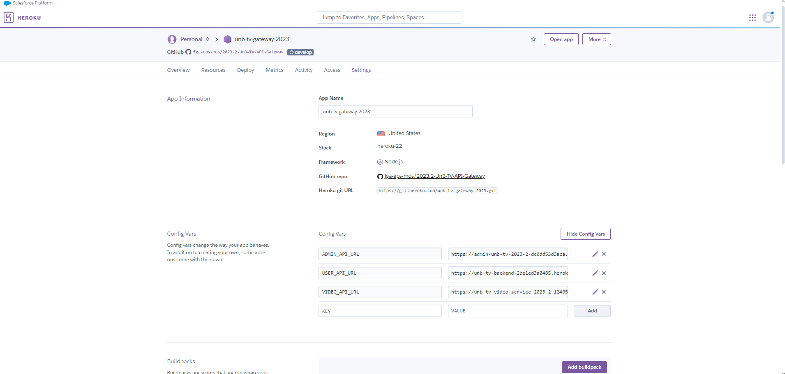

## Deploy repositório FRONTEND

# Importe um projeto:

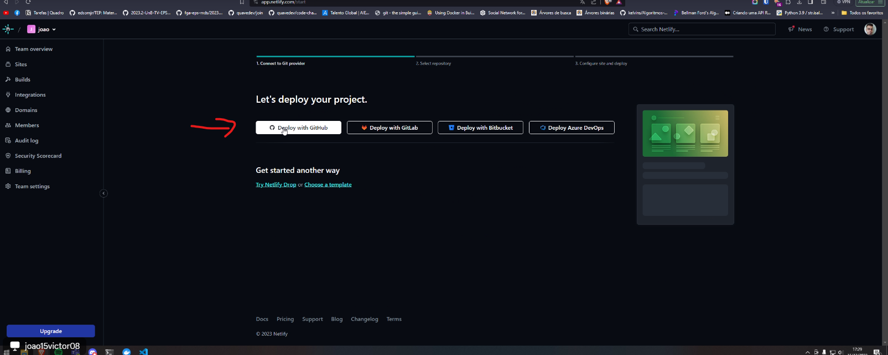
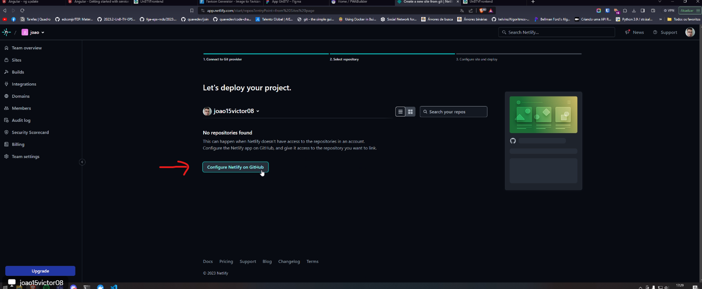
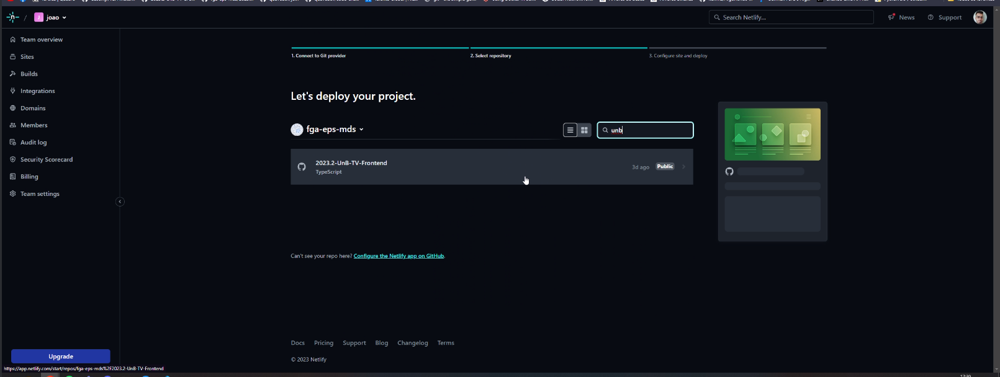
# Escolha um repositório
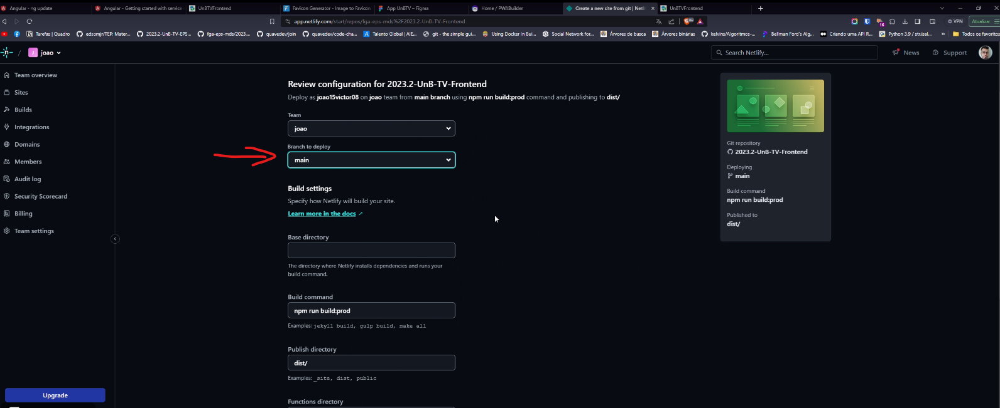
# Coloque esse valor nesse campo

# Faça o deploy
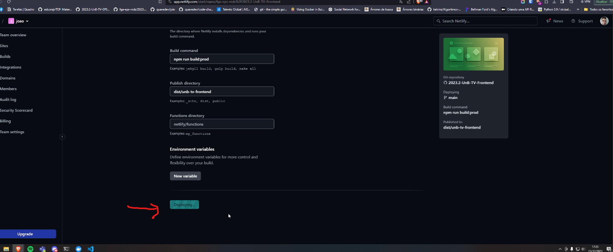

| Data       | Versão | Descrição                  | Autor(es)      |
| ---------- | ------ | -------------------------- | -------------- |
| 15/12/2023 | 1.0    | Adição do documento | Geraldo Victor |